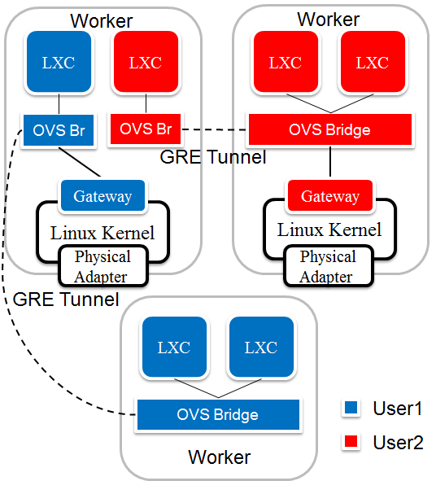
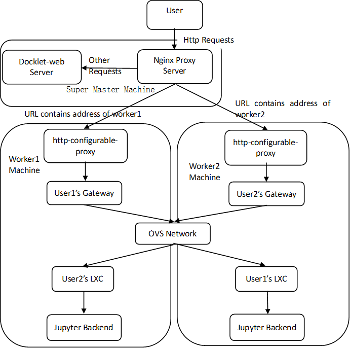
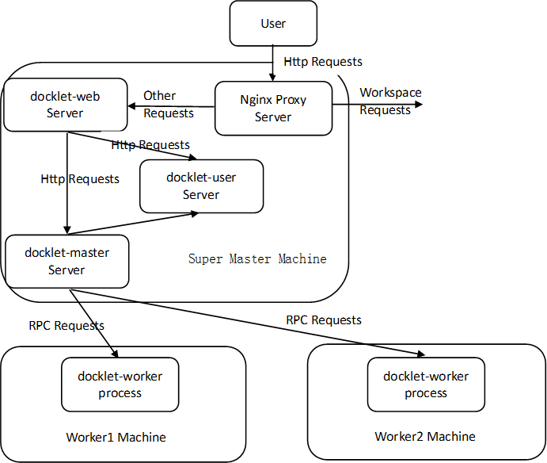

# Architecture of Network

## Architecture of container's networks
在目前版本中，为了规避VLAN耗尽的问题，采用了新型的独享式虚拟网络结构，完全去掉了VLAN，其结构如下图：

在这个结构中，有如下几个要点：

1.每个用户拥有一个独立的虚拟网。

2.只要物理机有容器就有用户的虚拟网桥。每个用户容器通过Veth Pair连接到宿主机上的用户虚拟网桥(OVS网桥)。网桥命名为"docklet-br-<用户id>"。

3.每个虚拟网是星型拓扑，网关物理机和非网关物理机通过GRE隧道连接。在两个物理机之间可能存在多个GRE隧道（不同用户拥有一个），以用户的id作为key值区分。

4.网桥和GRE隧道是动态创建和删除，用户启动(start)容器时才会创建相应网络（包括网桥和GRE隧道），用户停止(stop)容器时会调用/conf/lxc-script/lxc-ifdown
脚本停止该容器的网络。

5.分为集中式网关部署和分布式网关部署两种模式，即网关是集中式都部署在单Master物理机上，还是分布式部署到不同的Worker物理机上。上图展示的是分布式部署的
情况。网关与外部网通讯仍需通过NAT/iptables。

## Processing users' requests (Workspace requests)
对于用户请求的处理过程可以看出Docklet的结构，其处理过程如下两图，首先是Workspace请求部分。

## Processing users' requests (Other requests)
其他请求部分。

