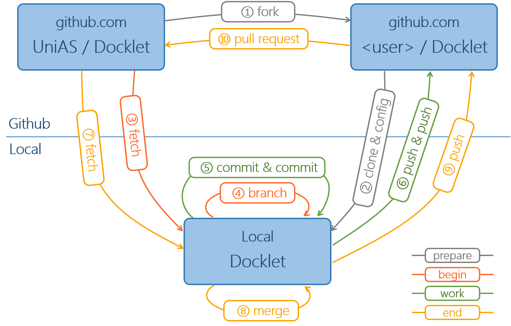

# Docklet Development Guide on GitHub
This document is intended for GitHubers to contribute for Docklet System.

## Introduction of Docklet Development Workflow
We use fork and pull request workflow to push forward Docklet Project.



## Step by Step
### Prepare
Before work, we need to prepare our working repository. These actions should be executed just once.
##### Step 1 : fork
Open https://github.com/unias/docklet in your browser and click **Fork** button on the top-right corner.
##### Step 2 : clone & config
* clone docklet from your github repository
```
git clone https://github.com/YourName/docklet.git
```
* config your local repository
```
# add unias/docklet as your upstream
git remote add upstream https://github.com/unias/docklet.git
# set push to upstream not work
git remote set-url --push upstream no_push
```

### Work
This part is about the steps of making contributions to Docklet by pull request.
#### Work : Begin
##### Step 3 : fetch
Fetch the latest code from **upstream(unias/docklet)**
```
git fetch upstream
```
##### Step 4 : branch
Create new branch for your work
```
git checkout -b BranchName upstream/master
```
This is not the step you must do and you can work on local master branch. But we recommend you follow these steps. Using branch to develop new features fits git.
#### Work : Work
Now you can focus on your work by **commit** and **push**.
##### Step 5 : commit & commit
Commit is commit. Nothing to say.
##### Step 6 : push & push
Push your work to **your own Github repository** by **BranchName**
```
git push origin BranchName
```
#### Work : End
After you complete work of this feature, you maybe want to create a pull request to unias/docklet. Please follow steps below.
##### Step 7 : fetch
Fetch the latest code from **unias/docklet**
```
git fetch upstream
```
##### Step 8 : merge
Merge upstream's latest code to your working branch
```
git merge upstream/master
```
Please ensure that you are on your working branch.

If conflict happens, resolve it and commit.
##### Step 9 : push
Push to your github repository by BranchName.
```
git push origin BranchName
```
##### Step 10 : pull request
Open https://github.com/YourName/docklet, click **New pull request** and select your working **BranchName** to create the pull request.

## Tips
##### local master
After you fetch upstream code, you can move forward your local master branch to upstream/master. And push your github repository master branch to update.
```
git fetch upstream
git checkout master
git merge upstream/master
git push origin master
```
##### pretty git log or git log with GUI
You can config your git log command with pretty format.
```
git config --global alias.lg "log --graph --color --pretty=format:' %Cred%h %Creset/ %<(10,trunc)%Cblue%an%Creset | %<(60,trunc)%s | %cr %Cred%d' --remotes --branches"
```
Now, type **git lg** to see what happens.

Of course, you can use GUI with git. **gitg** is a good choice. It shows log of git very friendly.
##### understand git log
git log has much information. You should understand the log info of git. This can help you know how to move forward your work. Especially the reference of branches : upstream/master, HEAD, master, origin/master, other branches.
##### graphs/network of github
The Graphs/Network of Github is very useful. With this, you can know whether you can create a pull request without conflict. Open https://github.com/unias/docklet/network in your browser and see the network graph of docklet.  
