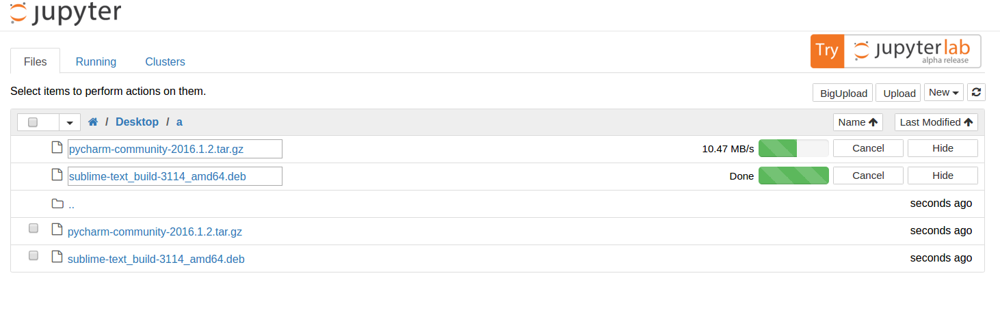

# Big File Upload for Jupyter Notebook

Author: [Wentao Zhang](zwt@pku.edu.cn)  
Source Code: https://github.com/nsknojj/notebook/tree/big-upload

[Jupyter](http://jupyter.org/) Notebook is a web-based notebook environment for interactive computing. It satisfies the demands of every user for processing data. However, while big data are accessible for a lot of users nowadays, Notebook doesn't support big file upload with web interface. It only allows uploading files up to 25MB. Big Upload Module is designed to solve this problem and keep this upload function compatible with Notebook.

## Usage - Setup Big Upload Module
Make sure you have installed Jupyter.  
If not, you can find the installation documentation for the
[Jupyter platform, on ReadTheDocs](http://jupyter.readthedocs.org/en/latest/install.html),   
or you can install it with pip3:
```(python)
$ sudo pip3 install jupyter
```
If you want to install it with python2, use "pip" instead of "pip3". This way is also effective in the following steps, e.g. replacing "python" with "python3".
If you have not installed pip3, you can run *apt-get install pip3* or install it by [official instruction](https://pip.readthedocs.org/en/stable/installing/).  

Download the Big Upload Module from its [Github Link](https://github.com/nsknojj/notebook/tree/big-upload)  and put it in a position you like, then change to this directory in your cmd.  

Run setup command:
```(python)
$ sudo python3 setup.py install
```
Run Notebook:
```(python)
$ jupyter notebook
```
It will open your default browser. Now you can try to upload a big file in your notebook.    


## Design - How Big File Upload Works
### Prototype: [jQuery-File-Upload](https://github.com/blueimp/jQuery-File-Upload)
It has provided a jquery front end in which **chunked file upload** has been implemented, and a php back end to handle chunked file. It provides a series of api, such as **stop** and **abort**. You can define your own callback functions for **add**, **progress**, etc.  All I need to do is transplanting the front end, and building a back end handler with tornado framework based on the given php server.
### The Front End & Back End of Jupyter Notebook
* Notebook's back end is built with tornado framework. You can see all the url handlers in *notebook/services*. Handlers in *notebook/services/contents* are related to uploading, downloading, saving and other functions we don't concern.  
* What I call front end are those webpages, scripts and style sheets.   
Webpage templates are in *notebook/templates*. We only concern "tree.html", which shows the tree structure of the opened file system.  
Scripts relevant to my work are in *notebook/statics/tree/js*. They manage the file list and setup the elements in the tree webpage.  

### Old Upload Process
```(python)
notebook
    |----statics/tree/js/main.js # Setup upload button, upload it to api url
    |----services/contents/handlers.py # Handle requests from url: api/contents/($file_path)
    |----templates/tree.html
    `----tree/handlers.py # Handle main url, render the tree template.
```
### Big Upload Process
```(python)
notebook
    |----statics
    |        |----tree/js/main.js* # Setup big-upload button with scripts in [bigupload/js]
    |        `----[bigupload/js] # Now upload the chunked file to a new url: api/upload_handlers/($(file_path))
    |
    |----services
    |        |----[bigupload/handlers.py] # Handle requests from a new url
    |
    `----templates/tree.html* # Add BigUpload button
```
The suffix star in the file name means this file has been modified. The square brackets means this file is new.
### Divide Files to Chunks
* Front end uses [Blob API](https://developer.mozilla.org/en-US/docs/Web/API/Blob) to divide the file to several chunks, then upload it in a form using POST method. This form contains the content range of this chunk, e.g. 0-99999 or 100000-199999, and the content size.  
* Back end just handles the files according to file path, content range, content size and the payload. It will find the correct file to append the payload to. The file's name should be same, and its current size should be equal to the start of content range.

## Experiment
### Bitrate
About 10MB/s ~ 20MB/s, on local host.
### Multifile Upload
Test passed, and the uploaded files had no difference.
### 5GB Big File Upload
Test passed, and the uploaded files had no difference.
### Cancel the Upload
Test passed, and the partially uploaded files were removed.
