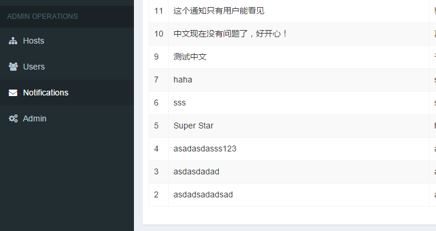
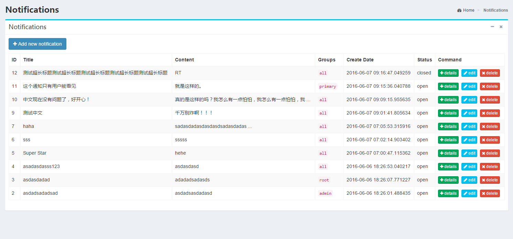
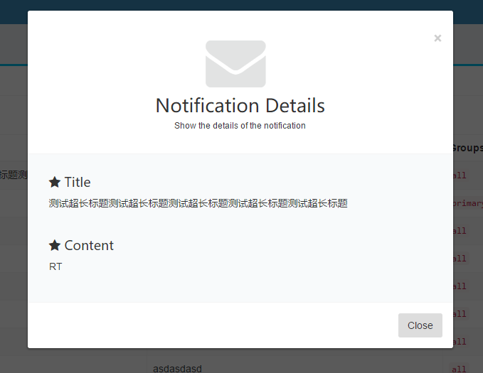
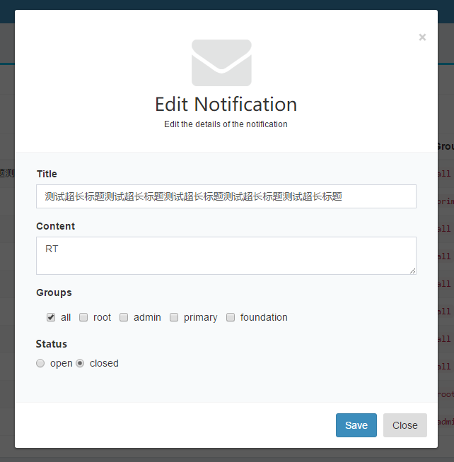
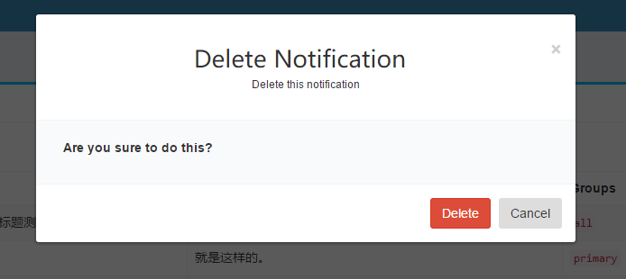
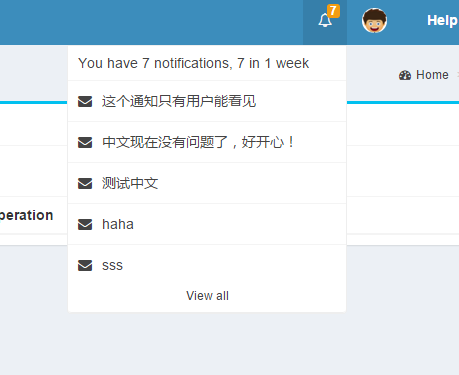
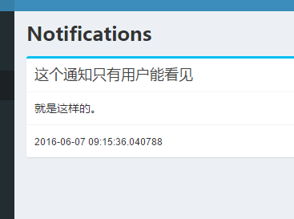

class: center, middle

# Docklet Notification Module
Author: [Tang Shuang](mailto:tangshuang@pku.edu.cn)
 
Source Code: https://github.com/tangxiaoshuang/docklet

---

#Goals
1. **Notification module** aims to help the administrators send essential information to users.
2. Administrator can **create**, **modify** or **delete** a notification easily.
3. A notification should has **target groups**. Only users belong to these groups can receive the notification.

---

#Design
####For administrators:
1. Add a new operation option named "Notification" in the dashboard page.
2. In this operation panel, all the notifications is listed in a table. We can preview, modify and delete the notification simply by clicking the button.

---

#Design
####For users:
1. Add an icon in the top bar, this icon is used as the entry of the notification list. The number on this icon means the number of new notifications in 1 week.
2. Click the icon and we can see a list. All the notification for user's group is in this list. Click the list item, a detail page will be opened.

---

#Back-end Design
- Create 2 tables in SQLite  to save the notification data.
- Provide interfaces for administrators to control the notification module.
- Provide interfaces for users to query their own notifications.

---

#Front-end Design
- All elements are from AdminLTE and Bootstrap.
- Use ajax polling to load the notification data.

---

#Demo

---

#Demo

---

#Demo

---

#Demo

---

#Demo

---

#Demo

---

#Demo

---

#Experiments
- [x] Create a new notification.
- [x] Modify a notification.
- [x] Delete a notification.
- [x] User can get the newest notification.
- [x] Group filter works.

---

#Gains
这部分用中文吧...
- 首先对分布式操作系统的具体组成有了一定的了解。对LXC有了具体的了解，对Linux操作系统的启动过程有了了解。
- 通过实习任务，对Docklet项目使用的Flask框架和Bootstrap有了实际的了解。
- 基本掌握了Python语言，对Github也有了更详细的了解。