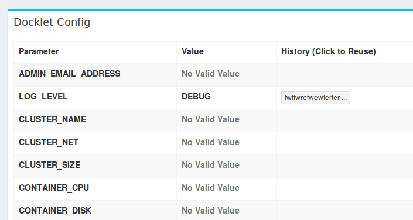
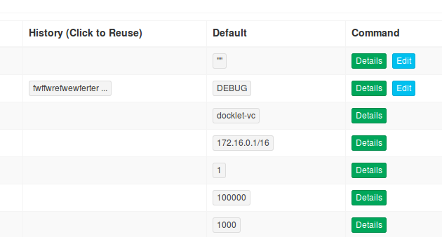
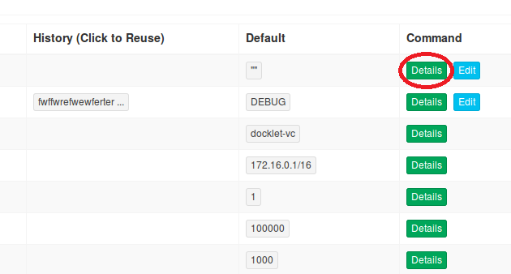
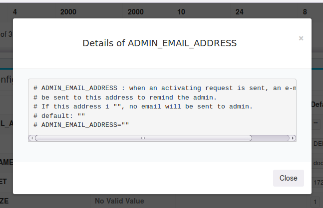
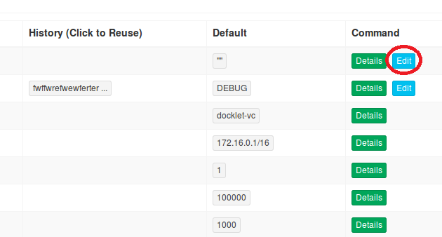
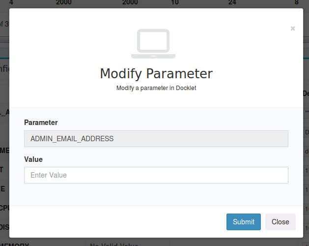
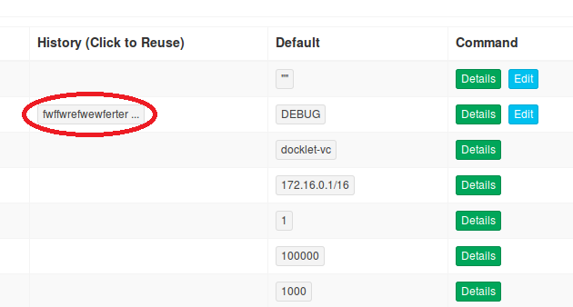
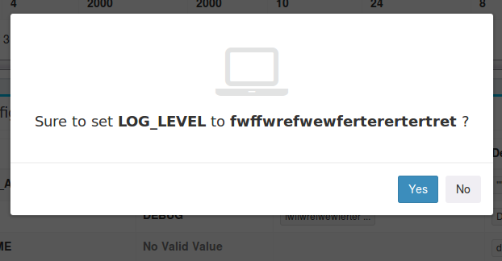
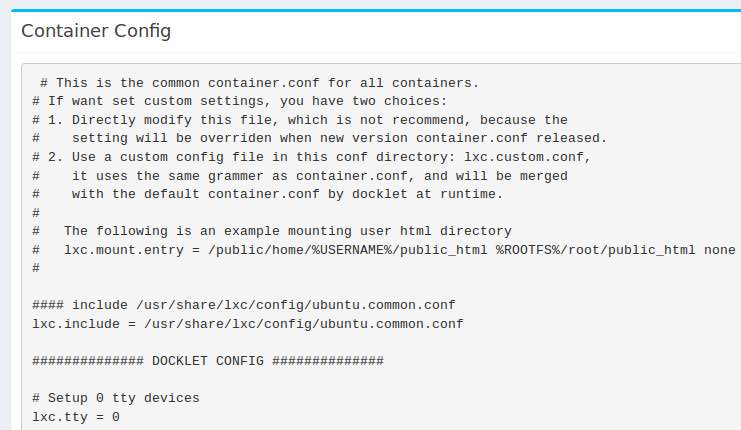

class: center, middle

# Admin Interface

Author: [Fan Shixiong](mailto:807976844@qq.com)  

Source Code: https://github.com/fanshibear/docklet

---

# Goals

1. To provide an interface for administrators to browse system settings that are recorded in docklet.conf and container.conf.  
2. To enable administrators to modify parameters that will take effect immediately.

---

# Design

1. Add a table to the original Admin page to display system settings.
2. Provide a button for every parameter to view the detailed comments.
3. Provide a button for every aprameter that can be modified to modify it.
4. Display default value and historical values for every parameter.
5. Set these default and historical values clickable to reuse them.
6. For container.conf, add a text field to show its complete content.

---

# Design

 
---

# Design

 
---

# Design

 
---

# Design

 
---

# Design

 
---

# Design

 
---

# Design

 
---

# Design

 

---

# Design

 

---

# Back-end Design

1. Parse the configuration files by regular expression.
2. Store default value and historical values in configuration files with special formats. 

---

# Experiments

1. Browse the table to check if all parameters are displayed in the right way. Succeeeded.
2. Click every button to check if it responses in the right way. Succeeded.
3. Modify a parameter to check if it works. Succeeded.
4. Browse the table again to check if there is a change at the historical-value position of the modified parameter. Succeeded.

---

# Gains

1. Learned about many useful tools and frameworks like Git, Flask and Bootstrap.
2. Became more familiar with programming languages like Python, HTML and Shell script when reading and writing codes.
3. Got much knowledge of Linux System especially on its network and file system.
4. Understood what Container is and how it works. 
