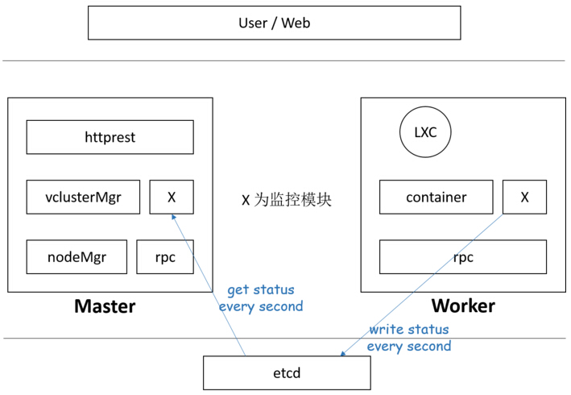
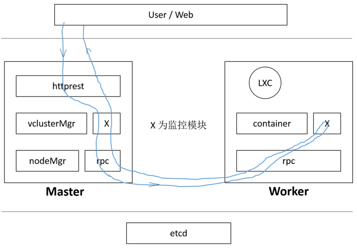

class: center, middle

# Monitor功能的优化

信科13级 朱域坚

---

# 主要完成的工作 

1. 容器和物理机磁盘使用信息的监控
2. 性能优化：以rpc机制代替原来的etcd传递信息
3. 容器真实运行时间的统计

---

# 磁盘使用信息的监控

- 利用python模块psutil的`disk_usage`函数收集信息。
- 该函数可以收集所有挂载的磁盘使用信息，由于容器使用时会分一个单独的磁盘挂载到它的根目录，因此可以收集到。

---

# 用rpc机制代替原来的etcd

## etcd存在的问题

- 读写效率太低：etcd每秒大约只能进行千次的读写，若每个容器每秒需要写一次，那最多只能支持千个容器同时存在，这是远远不够的。
- 消耗资源过多：etcd的读写是通过http协议进行的，效率比较低，经测试，单个worker每秒写个位数的容器信息也要占用1%以上的CPU

---

# 原来的设计

---

# rpc机制的设计

- 现有的worker负载cpu使用率降到0.5以下

---

# 真实运行时间的统计
- 根据容器的pid, 利用ps命令收集容器运行的时间，只是进程运行时间，容器重启后进程会变
- 因此真实时间还要加上lasttime，初始时为0
- 若收集过程中pid与之前不同，说明容器重启了，则把之前的时间放到lasttime里

